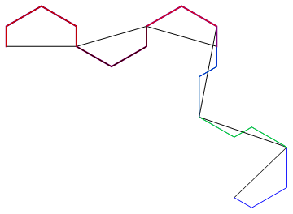
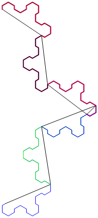
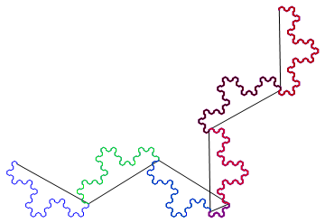
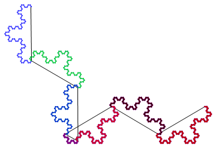
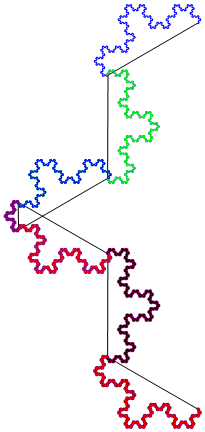
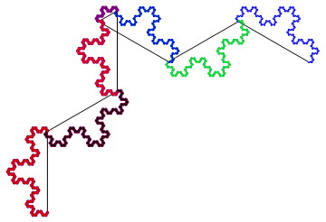

# Knacci-Utils
This is a semi-maintained and developing library for k-nacci words and word curves in python, first developed for research in 2018-2019.
## Introduction to -nacci Words and Curves
The k-nacci word is a string over the alphabet  generated recursively via the rules:

<p align="center"></p>

<p align="center"></p>

The word curves are drawn via turtle-graphics (a non-branching Lindenmyer System, if you like) via a drawing rule:

  (1) Initalize: declare the turning angle , set the inital drawing angle to , and place the turtle on . Set the index  to 1.

  (2) Move the turtle forward one step.

  (3) If the th character of the word is a '0', turn the turtle's direction by .

  (4) Increment the index  by one.

  (5) If , return to step 2.

To generate the fractal, we take each curve and rotate/scale it so that the endpoint of the curve touches . Then we take the limit of the modified curve as .


## Code Snippets
Usage examples of the files included in this repo:

### WordGen.py

With Knacci Utils, you can obtain all types of -nacci words easily. Get  via the command `f(k,n)`. For example,

```python
from WordGen import f

for n in range(1,10):
    print(n, f(2,n))
  ```
  
 You can also get  via the command `t(k,n)`.
 
 ### Debugging.py
 
 It is easy to test hypotheses about the drawing rule with `random_word`, which returns a random binary word of any arbitrary length. There are a few other tools.
 ```python
 from Debugging import random_word
 w = random_word(100)       #makes a random binary word of length 100
 is_alphabet_valid(w)       #checks to see if the alphabet is a subset of {'0','1'}
 ```
 
 ### AngleAndVertex.py
This gives you , draws pictures of the word curves, and lets you have a list of vertices in the word curve.
  ```python
  
 from math import pi
 from WordGen import f
 from AngleAndVertex import alpha_coeff, vertices, draw_me, end_position
 
 #gives the coefficient of alpha that the drawer is 
 # pointing after drawing the word, related to net angle.
 alpha_coeff(f(3,5))
 
 #a list of vertices in the word curve given some drawing angle
 vertices(f(2,5), pi/3)
 
 #plt.plot(), plt.show() the vertices in the word curve.
 draw_me(f(2,11), pi/3)    
 
 #gives both the coefficient of alpha after drawing and also the last vertex in the word curve
 end_position(f(2,17), pi/3)      
 ```
 
 ### WordSplit.py
 For discovering word generation patterns. There also exist some word comparison generators, not sure what I was doing with those.
 
 ```python
 from WordGen import f
 from WordSplit import split_to
 
 # outputs all possible word decompositions given the subwords in the dict.
 split_to(f(2,7), {"f(2,6)":f(2,6), "f(2,5)":f(2,5), "f(2,4)":f(2,4), "f(2,3)":f(2,3)}) 
 ```
 
 ### HighLevelEndpoints.py
 Determine the endpoints of a composition of words. This file uses numpy.
 ```python
 from math import pi
 from WordGen import f, t
 from HighLevelEndpoints import wordmat, ep_for_words
 
 # z(w) + wordmat(w).z(v) = z(wv)
 #gives the translation/rotation matrix for 
 # drawing another word curve after drawing a word.
 wordmat(f(2,7), pi/3) 
 #gives the endpoint and drawing angle coefficient after drawing all words given.
 ep_for_words(pi/2, f(2,7),f(2,8),t(2,5)) 
 ```
 
 ## Impact: 
Aided validation of the IFS that makes the 2-nacci word fractal. We used combinatorial tools to observe recurring patterns in word-decompositions.
### Periodicity mod 2 in the 2-nacci words (odd)







 
 
 
 
 

